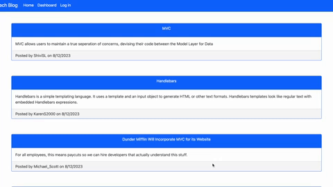

# CMS-Tech_Blog-Site


## Technology used
| Technology Used         | Resource URL           | 
| ------------- |:-------------:| 
| Deployed Application  | [https://tms-blog-shirvanyank-9efca1bc849d.herokuapp.com/](https://tms-blog-shirvanyank-9efca1bc849d.herokuapp.com/) |
| My Repository      | [https://github.com/ShirvanyanKaren/CMS-Tech_Blog-Site](https://github.com/ShirvanyanKaren/CMS-Tech_Blog-Site) |
| Sequelize | [https://sequelize.org/api/v6/class/src/model.js~model](https://sequelize.org/api/v6/class/src/model.js~model) |
| Express JS | [https://expressjs.com/en/4x/api.html#express.router](https://expressjs.com/en/4x/api.html#express.router) |
| MySQL  | [https://dev.mysql.com/doc/](https://dev.mysql.com/doc/) |
| Handlebars | [https://handlebarsjs.com/guide/](https://handlebarsjs.com/guide/) |
| Express Handlebars  | [https://www.npmjs.com/package/express-handlebars](https://www.npmjs.com/package/express-handlebars) |
| Nodemon  | [https://www.npmjs.com/package/nodemon](https://www.npmjs.com/package/nodemon) |
| Express Session  | [https://www.npmjs.com/package/express-session](https://www.npmjs.com/package/express-session) |
| Git | [https://git-scm.com/](https://git-scm.com/)     | 


# Description

The following application entailed creating a Tech Blog website that allowed users to sign in, sign up, vew posts, add posts, and add comments among other features.

The application had to meet the following acceptance criteria:

```md
GIVEN a CMS-style blog site
WHEN I visit the site for the first time
THEN I am presented with the homepage, which includes existing blog posts if any have been posted; navigation links for the homepage and the dashboard; and the option to log in
WHEN I click on the homepage option
THEN I am taken to the homepage
WHEN I click on any other links in the navigation
THEN I am prompted to either sign up or sign in
WHEN I choose to sign up
THEN I am prompted to create a username and password
WHEN I click on the sign-up button
THEN my user credentials are saved and I am logged into the site
WHEN I revisit the site at a later time and choose to sign in
THEN I am prompted to enter my username and password
WHEN I am signed in to the site
THEN I see navigation links for the homepage, the dashboard, and the option to log out
WHEN I click on the homepage option in the navigation
THEN I am taken to the homepage and presented with existing blog posts that include the post title and the date created
WHEN I click on an existing blog post
THEN I am presented with the post title, contents, post creator’s username, and date created for that post and have the option to leave a comment
WHEN I enter a comment and click on the submit button while signed in
THEN the comment is saved and the post is updated to display the comment, the comment creator’s username, and the date created
WHEN I click on the dashboard option in the navigation
THEN I am taken to the dashboard and presented with any blog posts I have already created and the option to add a new blog post
WHEN I click on the button to add a new blog post
THEN I am prompted to enter both a title and contents for my blog post
WHEN I click on the button to create a new blog post
THEN the title and contents of my post are saved and I am taken back to an updated dashboard with my new blog post
WHEN I click on one of my existing posts in the dashboard
THEN I am able to delete or update my post and taken back to an updated dashboard
WHEN I click on the logout option in the navigation
THEN I am signed out of the site
WHEN I am idle on the site for more than a set time
THEN I am able to view posts and comments but I am prompted to log in again before I can add, update, or delete posts
```

Here is an example of how the application runs:




## Table of Contents
* [Model View Controller](#model-view-controller)
* [Usage](#usage-and-installation)
* [License](#license)
* [Questions](#questions) 


## Model View Controller

The development of this application utilized an MVC framework that handled SQL database storage via sequelize, the control of the application responses via routing and sessions, and view with the utilization of handlebars

### Model: SQL and Sequelize

The modeling of the application's database was done through the integration of sequelize that follows similar structure to MySQL mixed with javascript class and object model structures. The following model shows how sequelize establishes these relationships between models similar to how SQL tables and relative foreign keys. This model allows us to reference the user who posted the comment as well the post their comment belongs to.


```js

 Comment.init(
    {
        id: {
            type: DataTypes.INTEGER,
            allowNull: false,
            primaryKey: true,
            autoIncrement: true,
        },
        user_comment: {
            type: DataTypes.TEXT,
            allowNull: false,

        },
        user_id: {
            type: DataTypes.INTEGER,
            allowNull: false,
            references: {
                model: 'user',
                key: 'id'
            }

        },
        post_id: {
            type: DataTypes.INTEGER,
            allowNull: false,
            references: {
                model: 'post',
                key: 'id'
            }
        },
        comment_date: {
            type: DataTypes.DATE,
            defaultValue: DataTypes.NOW, 
        },
  
    },
    {
    sequelize,
    timestamps: false,
    freezeTableName: true,
    underscored: true,
    modelName: 'comment',
    },
);
```

### View: Handlebars

Handlebars essentially allowed this application to have seemless transitioning templates with corresponding templetes presented to the user based on the requesr. For this application, I integrated a main handlebars layout that served as a template for every other page view. The other views were integrated through the boy tag that renders html code.

```handlebars
{{{body}}}
```

Based upon the request and render done through controller routing, the response will render different views and within those views we can include partials through logical statements such as if and each. Within this example, once rendered the page will display posts to the associated user if they have any and a button to create a post. 


```handlebars
{{#if posts.length}}

{{#each posts as |post|}}
{{> dash-post post}}

{{/each}}

{{/if}}

<div class="d-flex justify-content-center mt-5">
<button type="button" class="btn btn-primary btn-lg" >
 <a class="text-white text-decoration-none" href="/dashboard/create">Add Post</a>
</button>
```


### Controller: Routing and Express Session

Through the use of middleware connecting to sequelize and utilized through express, the application allowed for the use of cookies that allows us to store data and retrieve it later. The following example shows how we store session data with a sign up users post. Once the user is signed in, we assign these values that allows us to authenticate the user permission to view pages or edit posts. 
```js
router.post('/', async (req, res) => {
  try {
    const userData = await User.create({
      username: req.body.username,
      email: req.body.email,
      password: req.body.password,
      
    });
    req.session.save(() => {
    req.session.username = userData.username;
    req.session.user_id = userData.id;
    req.session.loggedIn = true;
    res.status(200).json(userData);
    });
    
  } catch (err) {
    if (err.name === 'SequelizeUniqueConstraintError') {
      res.status(400).json({ error: 'Email already exists' });
    } else {
      console.log(err);
      res.status(500).json(err);
    }
  }
});
```

This authenticator helper allows us to redirect the user based on that saved session value. In this case if the user is not logged in they will be redirected, otherwise the middleware will move on to the next directory. 

```js
const withAuth = (req, res, next) => {
    if (!req.session.loggedIn) {
      res.redirect('/login');
    } else {
      next();
    }
  };
```

## Usage and Installation

To use simply visit the deployed site at:
* [Deployed Site](https://tms-blog-shirvanyank-9efca1bc849d.herokuapp.com/)

## License 
     
MIT licensing with permisions such as commercial use, modification, distribution and private use. Limitations include liability and warranty.

## Questions 

* Check out my other projects on my [my Github](https://github.com/ShirvanyanKaren)
* For any additional questions or concerns, please email me at kshirvanyan2000@gmail.com